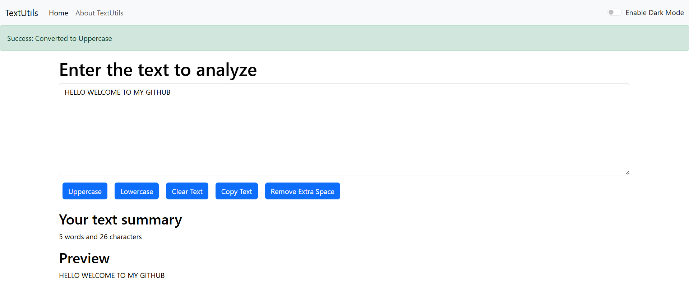
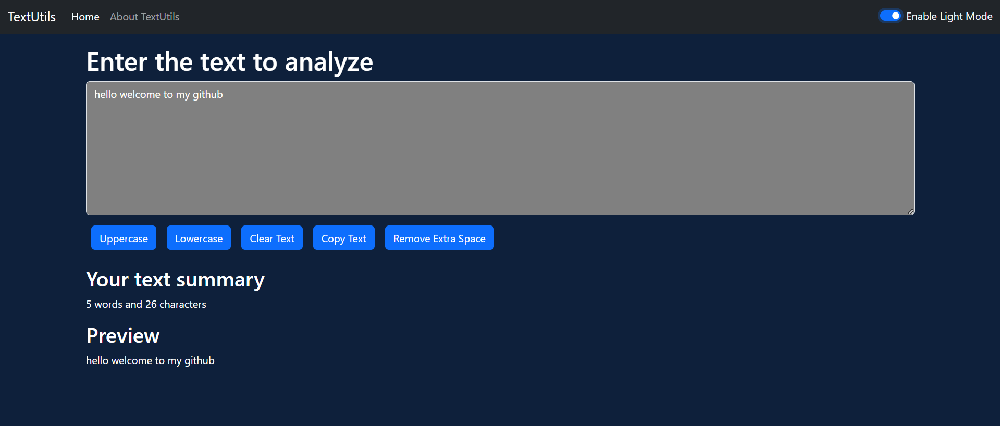

# TextUtils
This is a Text Utility App built using React that provides a collection of useful features to manipulate and analyze text. The app allows users to input text and perform various operations such as converting text to uppercase or lowercase, removing extra spaces, clearing the text, and copying the text to the clipboard with a single click. Additionally, it includes a real-time text preview that displays the entered text along with key details such as the word count and character count, helping users understand the structure of their content. The app also supports dark mode and light mode, offering users the flexibility to switch themes based on their preference, ensuring a comfortable user experience in different lighting conditions. This project demonstrates the power of React in building interactive and dynamic web applications, combining functionality with a clean and responsive user interface.
This is created using React + Vite
``` 
npm create vite@latest
```
Give project name alongwith framework and library
```
cd textUtils
npm install
npm run dev
```
### Live on : https://ayushisinha1719.github.io/TextUtils-React/

## Screenshots of the WebApp




